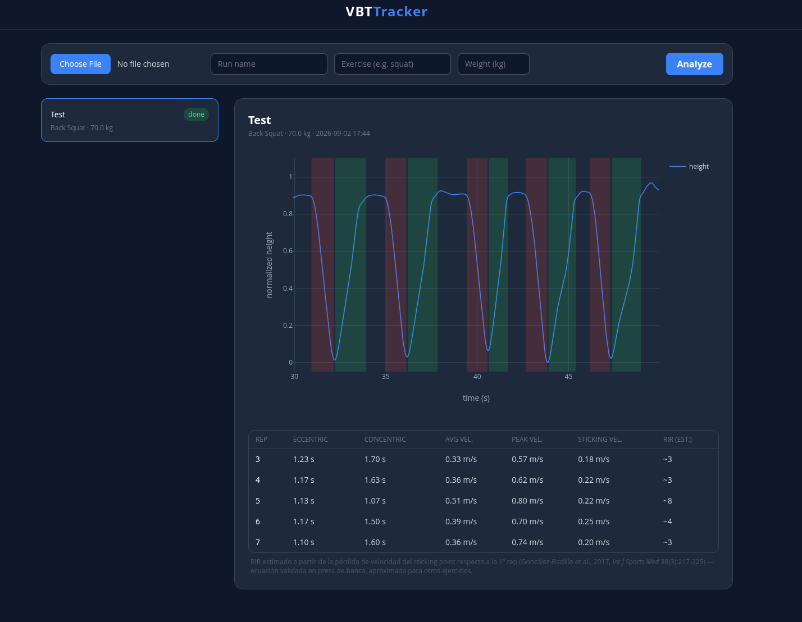

# vbt-tracker



Velocity-based training (VBT) from a phone video: point a camera at a weight
plate, upload the clip, get bar-path velocity per repetition — no wearable
sensor or linear encoder required.

> [!WARNING]
> Built for **power/explosiveness-oriented training** — sets where every rep
> is moved as fast as intent allows, so bar speed is a meaningful signal of
> effort and fatigue. It is **not** meant for **hypertrophy training**: on
> volume-accumulation sets taken close to failure at a deliberately
> controlled (non-maximal) speed, velocity loss doesn't track effort the
> same way, and the [RIR estimate](#how-it-works) — calibrated against
> maximal-intent reps — will read misleadingly high.

## Index

- [Motivation](#motivation)
- [Quick start](#quick-start)
- [Velocity-based training](#velocity-based-training)
- [How it works](#how-it-works)
- [Dataset](#dataset)
- [Training metrics](#training-metrics)
- [Design choices](#design-choices)
- [Architecture](#architecture)
- [Standalone scripts](#standalone-scripts)
- [Future improvements](#future-improvements)
- [License](#license)

## Motivation

Linear position transducers ("encoders") are the standard tool for VBT, but a
decent one costs several hundred euros — out of reach for most lifters
training on their own. Every barbell setup already has a cheap, plentiful,
perfectly circular reference object sitting on it: the weight plates. If a
phone camera plus a small object-detection model can track a plate closely
enough, it becomes a semi-accurate, essentially free substitute for an
encoder.

"Semi-accurate" is the operative word — this project has **not** yet been
validated against a real linear encoder on the same reps. That comparison is
planned as the next step; until then, treat the velocity numbers as directionally
useful (spotting fatigue, comparing reps within a session) rather than
lab-grade measurements.

## Quick start

Requirements: Docker, and access to a **Redis** and a **RabbitMQ** instance
(broker + result backend / pub-sub for progress events). If you don't have
either yet, the bundled dev compose file starts throwaway ones for you.

```bash
git clone <this-repo> vbt-tracker
cd vbt-tracker
cp .env.example .env               # then edit CELERY_BROKER_URL / CELERY_RESULT_BACKEND / REDIS_URL

# with your own Redis/RabbitMQ:
docker compose up --build

# or, to also spin up throwaway Redis/RabbitMQ for local testing:
docker compose -f docker-compose.yml -f docker-compose.dev.yml up --build
```

Then open <http://localhost:8000>, upload a video, name the run, and watch the
status update live while it processes. By default the worker runs on CPU
(`DEVICE=cpu`); set `DEVICE=0` in `.env` (and uncomment the GPU block in
`docker-compose.yml`) if you have an NVIDIA GPU with the
`nvidia-container-toolkit` installed.

## Velocity-based training

VBT uses the speed of the barbell — not just the weight on it — to gauge how
hard a set actually is. The same load can be crushed at 0.9 m/s on a fresh set
and grind out at 0.3 m/s once fatigue sets in; %1RM alone can't see that,
bar-speed can. It's used both to autoregulate training load session-to-session
and to flag when a set has gone far enough into fatigue to hurt the next one.

Three references if you want the background beyond this README:

- González-Badillo, J.J. & Sánchez-Medina, L. (2010). *Movement Velocity as a
  Measure of Loading Intensity in Resistance Training.* International Journal
  of Sports Medicine.
- Weakley, J. et al. (2021). *Velocity-Based Training: From Theory to
  Application.* Strength & Conditioning Journal.
- González-Badillo, J.J., Yañez-García, J.M., Mora-Custodio, R. &
  Rodríguez-Rosell, D. (2017). *Velocity Loss as a Variable for Monitoring
  Resistance Exercise.* International Journal of Sports Medicine, 38(3),
  217-225. — basis for the RIR estimate below.

## How it works

1. **Detect** the plate in each video frame with a YOLO segmentation model
   (single class: `Disk`), `yolo_batch_size` (default 8) frames per forward
   pass. Ultralytics' own default batch size is 16, but that doesn't apply
   here — a video `source` under `stream=True` silently runs at batch=1
   unless `batch` is passed explicitly, one frame per forward pass. Verified
   the detections come back bit-for-bit identical either way (tracking is
   still applied per frame, in order — batching only changes how the
   network's forward pass is scheduled); ~17% faster on a GPU (RTX 3070),
   a smaller but real gain on CPU too.
2. **Track** the plate's vertical center and mask diameter across frames
   (`app/vbt/track.py`); the diameter gives a pixel-to-meter scale, since a
   standard olympic plate is a known 45cm across.
3. **Segment into phases**: a 4-state hysteresis machine turns the normalized
   height curve into alternating eccentric/concentric phases
   (`app/vbt/phases.py`), and computes per-phase average velocity, peak
   velocity, and — for the concentric phase — the **sticking-point velocity**:
   the last point in the rep still moving at ≥25% of that rep's own peak
   velocity, i.e. the velocity right before it commits to decelerating into
   lockout (a fixed edge-trim isn't enough here — a rep with a long, gradual
   coast into lockout needs more of its tail excluded than a rep that stops
   sharply, or the near-zero lockout velocity gets reported as if it were a
   genuine sticking point).
4. **Estimate RIR**: each concentric rep's mean velocity maps directly to an
   RIR estimate via fixed thresholds — no comparison to other reps in the
   set. (An earlier version compared each rep to the *fastest* rep in the set
   instead; scrapped because it reports a high RIR for whichever rep happens
   to be fastest even when every rep in the set is objectively slow — it
   measures relative fatigue within the set, not actual proximity to
   failure.) The thresholds chain two tables from González-Badillo et al.
   (2017) (see [Velocity-based training](#velocity-based-training)): velocity
   → effective %1RM (their %1RM-velocity classification table, since velocity
   reflects current effort regardless of the prescribed load), then %1RM →
   mean reps to failure (their Table 1), interpolated between anchors and
   RIR = reps to failure − 1.

   The velocity fed in is `v_avg` (displacement/duration over the whole
   concentric phase) — the closest thing computed here to the paper's *mean
   propulsive velocity* (MPV: average velocity of just the accelerating
   portion of the rep, acceleration ≥ -9.81 m/s²). `v_avg` also includes the
   deceleration into lockout, since nothing here segments out a propulsive
   sub-phase, so it runs a bit low relative to true MPV — sticking-point
   velocity was tried first and dropped, since the literature behind these
   thresholds is built on MPV, not on a rep's local velocity minimum (that's
   a different line of research — locating the weakest point in the strength
   curve, e.g. Kompf & Arandjelović's sticking-point review — not fatigue/RIR
   estimation). Bench-press-specific either way (the equivalent squat/deadlift
   study, Rodríguez-Rosell et al. 2020, is paywalled) and applied to every
   exercise regardless. Treat the RIR figure as a rough, directional
   estimate, not a precise one.
5. **Show it**: an interactive chart (hover a phase to see its numbers) plus a
   per-rep table (duration, velocities, estimated RIR) and a saved PNG
   snapshot per run.

## Dataset

59 images (42 train / 20 val), hand-labeled with SAM in CVAT and exported as
Ultralytics YOLO segmentation format, single class (`Disk`). Images span
different backgrounds, plate colors, and plate brands to keep the model from
overfitting to one specific look.

## Training metrics

Model: `yolo26s-seg`, trained 400 epochs, batch 8, image size 640
(`disk-seg-s-v3` run). The shipped checkpoint (`models/best.pt`) is
Ultralytics' best-fitness snapshot, around epoch 118:

| Metric (mask)       | Value  |
|----------------------|--------|
| Precision             | 1.00   |
| Recall                 | 0.985  |
| mAP50                  | 0.995  |
| mAP50-95               | 0.995  |

Performance saturates early because, once the model has seen a handful of
plate colors/backgrounds, segmenting a single, high-contrast, perfectly
circular object is an easy task — which is also why a small dataset was
enough (see [Design choices](#design-choices)).

## Design choices

- **Only standard plates.** All olympic plates share the same 45cm diameter
  regardless of weight, so the pixel-to-meter scale needs no camera
  calibration — just the mask diameter. If your plates are visually very
  different from the ones in the training set (unusual color, bumper plates,
  heavy branding), you may need to fine-tune the model on a few labeled
  frames of your own (see `standalone_scripts/train.py`).
- **YOLO-s, not a bigger model.** Fast enough for near-real-time inference on
  a single GPU (or CPU, just slower), and segmenting one simple circular
  class doesn't need a larger model's capacity — which is also why so few
  training images were sufficient.

## Architecture

FastAPI + HTMX frontend, Celery worker for the actual video processing, and
Postgres to track runs (schema `vbt`, table `runs`). Progress is pushed to the
browser over Server-Sent Events, sourced from a Redis pub/sub channel per run
— no polling on either the worker or the browser side.

```
video upload -> FastAPI (POST /runs) -> Celery task -> YOLO tracking + phase analysis
                                              |
                                              v
                                   Redis pub/sub (progress) --> SSE --> browser
                                              |
                                              v
                                    Postgres (run status) + CSV/PNG on disk
```

Redis and RabbitMQ are **not** bundled in `docker-compose.yml` — bring your
own (or use `docker-compose.dev.yml` for local testing, see
[Quick start](#quick-start)).

## Standalone scripts

`standalone_scripts/` keeps the original CLI tools this project grew out of,
useful if you want to retrain the model or run the pipeline without the web
app:

- `train.py` — trains the YOLO-seg model on `disk_dataset/`.
- `predict.py` — runs inference on an image/video and saves the annotated output.
- `track_height.py` — tracks the plate in a video and plots its normalized height over time.
- `rep_phases.py` — splits a `track_height.py` CSV into reps/phases and computes VBT metrics.
- `fix_sleeve_labels.py` — dataset-cleanup utility (see its docstring).

Each has its own `--help`. `setup.sh` creates a local virtualenv for these
scripts (`ultralytics` and its dependencies only — no FastAPI/Celery needed
here).

## Future improvements

- **Keypoint model instead of segmentation.** Train a pose/keypoint model to
  detect the disk's top edge, bottom edge, and center directly, rather than
  a segmentation mask post-processed into a centroid + equivalent-circle
  diameter. Top-to-bottom distance would give the pixel diameter straight
  from two points instead of going through mask area, and the center
  keypoint wouldn't need a moments computation over a polygon — both should
  be more stable under motion blur or a partially-occluded disk, where a
  segmentation mask's edges are the first thing to degrade. The tradeoff is
  labeling cost: annotating keypoints is considerably more manual than the
  current SAM-assisted segmentation workflow (see [Dataset](#dataset)), SAM
  doesn't produce keypoints for you the way it does masks. Worth it if the
  current mask-based tracking turns out to be the accuracy ceiling once this
  project is validated against a real linear encoder (see
  [Motivation](#motivation)) — since we already know the disk's true
  diameter (45cm, fixed), keypoints that pin down its extent directly could
  plausibly do better than reconstructing it from a mask's area.

## License

MIT — see [LICENSE](LICENSE).
